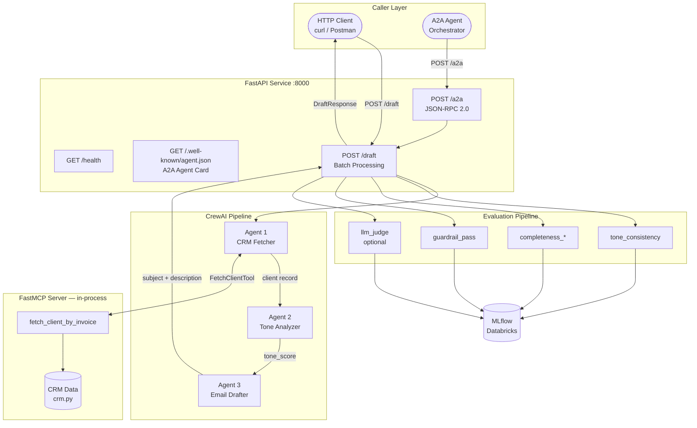
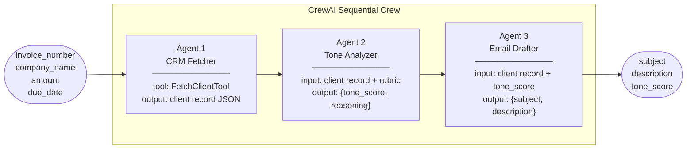
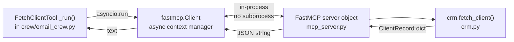
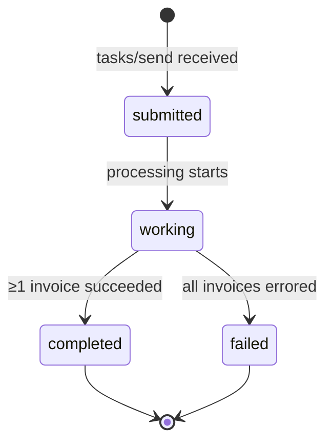
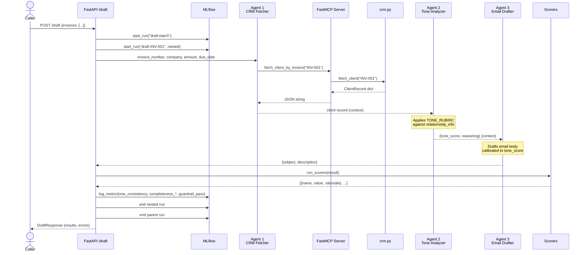
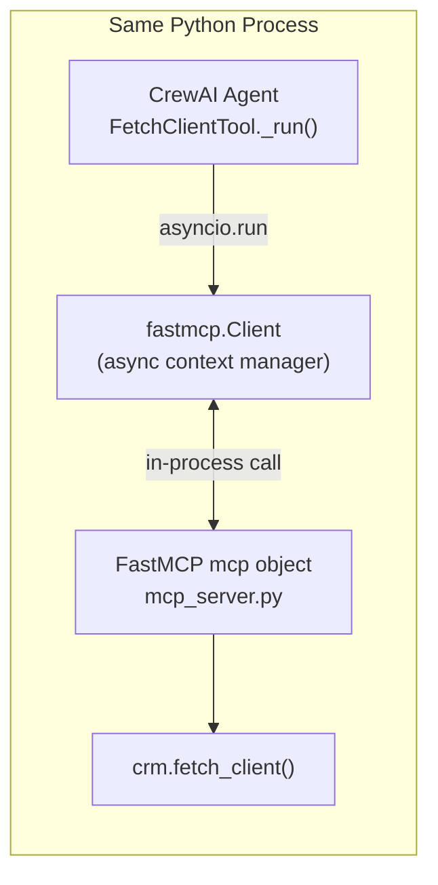
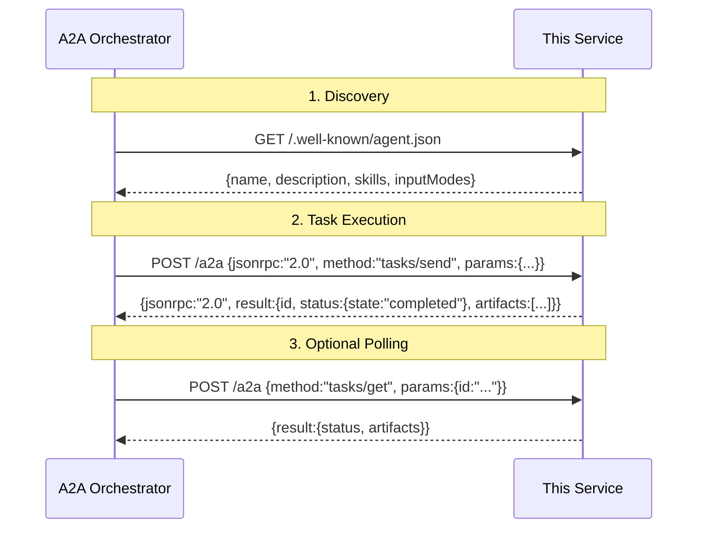
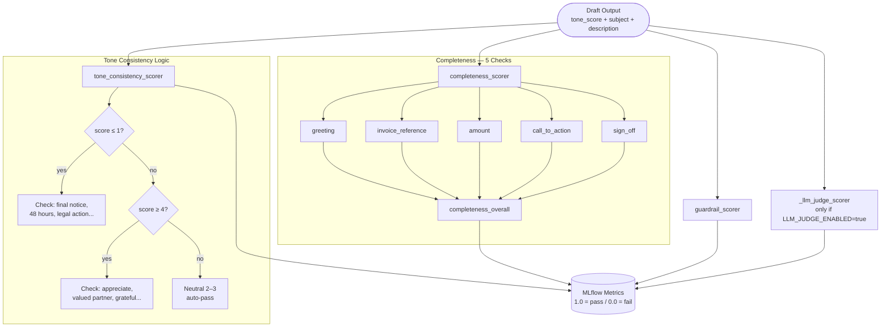

# System Design — Cash Collection Email Drafter

## Table of Contents

1. [Problem Statement](#1-problem-statement)
2. [System Overview](#2-system-overview)
3. [Architecture Diagram](#3-architecture-diagram)
4. [Component Deep-Dives](#4-component-deep-dives)
5. [Agent Pipeline](#5-agent-pipeline)
6. [Protocol Implementations](#6-protocol-implementations)
7. [Evaluation Pipeline](#7-evaluation-pipeline)
8. [Data Flow — End to End](#8-data-flow--end-to-end)
9. [Key Design Decisions](#9-key-design-decisions)
10. [Limitations & Future Work](#10-limitations--future-work)

---

## 1. Problem Statement

Accounts-receivable (AR) teams send hundreds of collection emails per week. Writing each email from scratch is slow; using a generic template ignores relationship context and damages client goodwill. The core challenge is **tone calibration** — the right firmness for a serial defaulter is very different from the right warmth for a high-value partner.

**Goal:** Given a batch of invoice records, produce contextually appropriate, personalised collection emails automatically — with quality guarantees.

---

## 2. System Overview

The system is a **FastAPI microservice** that exposes two interfaces:

- **REST (`POST /draft`)** — direct batch processing, synchronous response
- **A2A (`POST /a2a`)** — Google Agent-to-Agent JSON-RPC 2.0 protocol, making this service consumable by any A2A-compatible orchestrator

Each invoice flows through a **three-agent CrewAI pipeline**. Agent 1 retrieves CRM data via an in-process **FastMCP** tool call. Agent 2 applies a tone rubric to decide the appropriate tone score. Agent 3 drafts the email. Every output is evaluated by a **quality scorer pipeline** and all metrics are persisted to **MLflow / Databricks**.

---

## 3. Architecture Diagram



---

## 4. Component Deep-Dives

### 4.1 `app.py` — FastAPI Application

The entry point. Responsibilities:

- Bootstraps MLflow tracking at startup via `lifespan` context manager
- Validates all incoming requests with Pydantic models
- Wraps each invoice in a **nested MLflow run** (parent = batch, child = per-invoice) for granular experiment tracking
- Catches per-invoice exceptions and returns partial successes — a single bad invoice does not fail the batch

**Endpoint summary:**

| Method | Path | Purpose |
|---|---|---|
| GET | `/health` | Liveness probe |
| GET | `/.well-known/agent.json` | A2A Agent Card (discovery) |
| POST | `/a2a` | A2A JSON-RPC 2.0 (agent interop) |
| POST | `/draft` | Batch invoice → email drafting |

---

### 4.2 `crew/email_crew.py` — Three-Agent Pipeline

A sequential CrewAI crew. Each agent uses `gpt-4o-mini` with `temperature=0.3` for low-variance, consistent outputs.



**Agent 1 — CRM Fetcher**
- Uses `FetchClientTool` (a custom CrewAI `BaseTool`) to call the FastMCP server in-process
- Passes the raw client record to Agent 2 unchanged — no interpretation at this stage

**Agent 2 — Tone Analyzer**
- Receives the client record and the full tone rubric text
- Outputs strict JSON: `{"tone_score": int, "reasoning": "str"}`
- Two fallback parsers (JSON → regex) ensure robustness against LLM formatting variance

**Agent 3 — Email Drafter**
- Receives both the CRM record and the decided tone score
- Must produce all four structural elements: greeting, body (invoice + amount + date), call-to-action, sign-off
- Outputs strict JSON: `{"subject": str, "description": str}`

---

### 4.3 `mcp_server.py` — FastMCP Tool Server

A **FastMCP** server object that exposes the `fetch_client_by_invoice` tool.



- Imported directly into the agent crew — no subprocess, no network port
- Can also run standalone via `python mcp_server.py` (STDIO transport) for external A2A use
- In production, replace `crm.fetch_client()` with a real CRM API call — the crew requires no changes

---

### 4.4 `crm.py` — Mock CRM

A typed dictionary store (`TypedDict`) with 8 records covering every tone tier from 0 to 5. Drop-in replacement target — swap `fetch_client()` with a real HTTP call to Salesforce, HubSpot, or any CRM API.

---

### 4.5 `a2a/` — Agent-to-Agent Protocol

Implements the [Google A2A specification](https://github.com/google-a2a/A2A).

**Task state machine:**



**`agent_card.py`** — builds the Agent Card JSON served at `/.well-known/agent.json`. Contains agent name, description, skill definitions, input/output schemas, and supported transport modes.

**`task_handler.py`** — JSON-RPC 2.0 dispatcher with an in-memory task store supporting `tasks/send` and `tasks/get`.

---

### 4.6 `evaluation/scorers.py` — Quality Pipeline

Four scorers operating on the final `{invoice_number, tone_score, subject, description}` dict:

| Scorer | Method | Pass condition |
|---|---|---|
| `tone_consistency` | Regex keyword match | Firm markers for score ≤1; polite markers for score ≥4 |
| `completeness_greeting` | Regex | `dear`, `hello`, or `hi` detected |
| `completeness_invoice_reference` | Regex | Invoice number pattern detected |
| `completeness_amount` | Regex | Dollar amount or "outstanding balance" detected |
| `completeness_call_to_action` | Regex | Payment verb + deadline detected |
| `completeness_sign_off` | Regex | `regards`, `sincerely`, etc. detected |
| `guardrail_pass` | Regex blocklist | No offensive/threatening language |
| `llm_judge_professional_tone` | MLflow Guidelines (LLM) | LLM evaluates holistic appropriateness |

---

## 5. Agent Pipeline

### Sequence Diagram



---

## 6. Protocol Implementations

### 6.1 Model Context Protocol (MCP) — In-Process

MCP provides a standardised way for LLM agents to call tools. This project uses **FastMCP with in-process transport** — the server object is imported directly, no subprocess or network port needed.



**Why in-process over subprocess?**
- `crewai_tools.MCPServerAdapter` uses an interactive `click.confirm()` check for the `mcp` package — in a non-TTY Docker container this raises `click.exceptions.Abort`, crashing the server silently
- In-process removes the subprocess entirely: no spawn latency, no PYTHONPATH wiring, no TTY issues
- The `mcp_server.py` object can still run standalone via STDIO for external use

**Tool exposed:**

```python
fetch_client_by_invoice(invoice_number: str) -> dict
# Returns: {invoice_number, client_name, client_email,
#           relationship_info, outstanding_amount, due_date}
# Or:      {"error": "No CRM record found for ..."}
```

---

### 6.2 Google A2A Protocol (Agent-to-Agent)

A2A defines how autonomous agents discover and interact with each other.



---

## 7. Evaluation Pipeline

### Why Evaluate at Inference Time?

LLMs are non-deterministic. Even with `temperature=0.3`, occasional outputs miss structural elements, use the wrong tone markers, or produce borderline content. By running scorers synchronously on every output:

- Failures are surfaced immediately in logs and MLflow metrics
- Metric trends reveal prompt regressions over time without manual inspection
- The guardrail scorer acts as a hard content safety layer

### Scorer Flow



### MLflow Metric Schema

Each nested run logs:

```
tone_consistency                  1.0 / 0.0
completeness_greeting             1.0 / 0.0
completeness_invoice_reference    1.0 / 0.0
completeness_amount               1.0 / 0.0
completeness_call_to_action       1.0 / 0.0
completeness_sign_off             1.0 / 0.0
completeness_overall              1.0 / 0.0
guardrail_pass                    1.0 / 0.0
llm_judge_professional_tone       0.0–1.0  (optional)
```

---

## 8. Data Flow — End to End

```mermaid
flowchart TD
    REQ([POST /draft\n{invoice_number, company_name, amount, due_date}])

    REQ --> VAL[Pydantic Validation]
    VAL --> PR[MLflow parent run\ndraft-batch]
    PR --> NR[MLflow nested run\ndraft-invoice_number]

    NR --> INV[run_for_invoice]

    subgraph pipeline [CrewAI Pipeline]
        INV --> F[Agent 1: fetch_client_by_invoice\nvia FastMCP in-process]
        F --> T[Agent 2: apply TONE_RUBRIC\nLLM → tone_score 0-5]
        T --> D[Agent 3: draft email\nLLM → subject + description]
    end

    D --> PARSE[Parse output JSON\nfallback: regex]
    PARSE --> SCORE[run_scorers\ntone + completeness + guardrail]
    SCORE --> LOG[log_scores_to_mlflow]
    LOG --> CLOSE[Close nested run\nClose parent run]
    CLOSE --> RESP([DraftResponse\n{results, errors}])
```

---

## 9. Key Design Decisions

### Sequential vs. Parallel Agents
CrewAI's sequential process was chosen deliberately. Each agent's output is the next agent's input — tone analysis requires the CRM record, email drafting requires the tone score. True parallelism isn't applicable within a single invoice. For batches, the natural parallelisation point is at the `/draft` endpoint level (future: `asyncio.gather` over invoices).

### In-Process MCP over Subprocess
The CRM tool could have called `crm.fetch_client()` directly. Using FastMCP in-process:
- Makes the tool boundary explicit and swappable (replace the CRM impl without touching the crew)
- Eliminates the TTY/Abort issue caused by `crewai_tools.MCPServerAdapter` in Docker
- The `mcp_server.py` object can still serve external callers via STDIO — no duplication

### Structured JSON Output with Dual-Parser Fallback
LLMs occasionally wrap JSON in markdown code fences or add preamble text. Both Agent 2 and Agent 3 outputs go through: `json.loads()` → regex extraction → graceful default. This makes the pipeline robust to prompt formatting variance without requiring strict output parsers that throw on any deviation.

### Synchronous Scorers (No Async)
The evaluation scorers are regex-based and run in microseconds. Running them synchronously in the same request thread keeps the architecture simple. The LLM-as-judge scorer is the only one with real latency cost, so it is opt-in via `LLM_JUDGE_ENABLED=true`.

### In-Memory Task Store for A2A
The `_task_store` dict in `task_handler.py` is sufficient for a single-instance demo. For production, replace with Redis or a PostgreSQL-backed store to support multiple replicas and task persistence across restarts.

### Partial Batch Success
A single bad invoice (unknown invoice number, LLM parsing failure, etc.) does not fail the entire batch. Errors are collected separately in the `errors` list so the caller gets all successfully drafted emails even if one fails.

---

## 10. Limitations & Future Work

| Area | Current State | Production Path |
|---|---|---|
| CRM data | In-memory mock dict | Replace `crm.py` with real CRM API; MCP interface stays unchanged |
| A2A task store | In-memory dict | Redis / PostgreSQL with TTL-based eviction |
| Concurrency | Synchronous, one invoice at a time | `asyncio.gather` over invoice batch |
| Authentication | None | OAuth2 / API key middleware on FastAPI |
| Streaming | Not supported | Server-sent events for real-time draft streaming |
| LLM | `gpt-4o-mini` hardcoded | Config-driven model selection; Claude, Gemini, Llama support |
| Evaluation | 4 scorers | Add human-in-the-loop feedback loop to MLflow dataset |
| MCP transport | In-process | MCP over HTTP/SSE for distributed tool servers |
