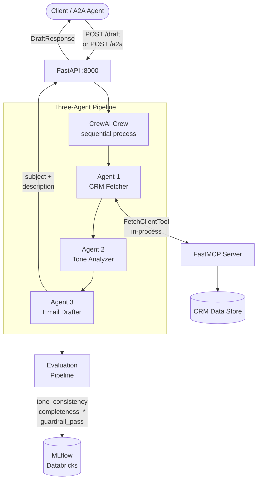
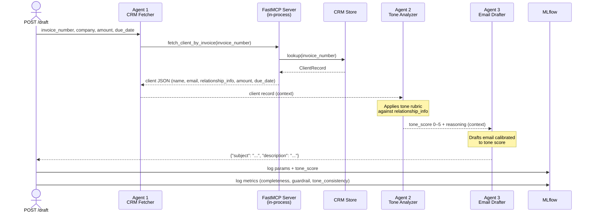
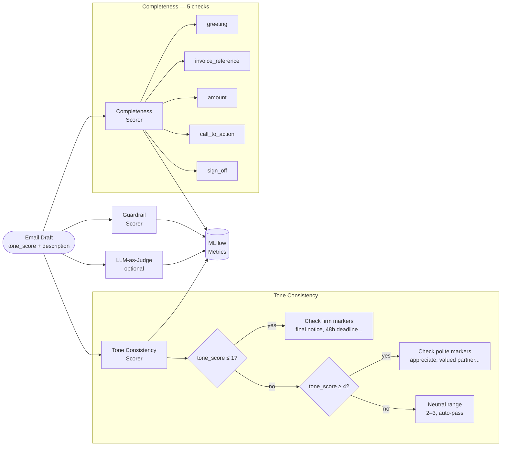
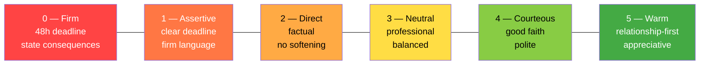

# Cash Collection Email Drafter

> A production-ready multi-agent AI service that automates accounts-receivable outreach. Given a batch of overdue invoices, it fetches live CRM data, decides the right tone per client relationship, drafts a tailored collection email, evaluates it through a quality pipeline, and logs every metric to MLflow — all in a single API call.

[](https://www.python.org/)
[](https://fastapi.tiangolo.com/)
[](https://github.com/crewAIInc/crewAI)
[](https://mlflow.org/)

---

## The Problem It Solves

Writing collection emails manually is tedious, error-prone, and relationship-sensitive:

- **Too firm with a high-value partner?** You damage a long-term relationship.
- **Too polite with a serial defaulter?** You send the wrong signal entirely.

This service solves that by reading each client's CRM history, running it through a structured tone rubric, and generating a contextually calibrated email automatically — then scoring it before it ever reaches a human.

---

## System Architecture



---

## Agent Workflow



---

## Tech Stack

| Layer | Technology |
|---|---|
| Agent Framework | [CrewAI](https://github.com/crewAIInc/crewAI) |
| LLM | OpenAI `gpt-4o-mini` |
| Tool Protocol | [FastMCP](https://github.com/jlowin/fastmcp) — in-process MCP server |
| Agent Interop | [Google A2A Protocol](https://github.com/google-a2a/A2A) — JSON-RPC 2.0 |
| API | FastAPI + Uvicorn |
| Evaluation | Rule-based scorers + optional LLM-as-judge |
| Experiment Tracking | MLflow → Databricks |
| Containerisation | Docker + Docker Compose |
| Language | Python 3.11+ |

---

## Quick Start

**Prerequisites:** Docker, Docker Compose, an OpenAI API key, and optionally a Databricks workspace.

### 1. Clone and configure

```bash
git clone https://github.com/Avii3301/cashCollection-A2A.git
cd cashCollection-A2A
cp .env.example .env
# Fill in your keys in .env
```

### 2. Start with Docker

```bash
docker compose up --build
```

The service starts on `http://localhost:8000`. The first build takes a few minutes to install all dependencies.

### 3. Verify it's running

```bash
curl http://localhost:8000/health
# {"status":"ok","service":"cash-collection-drafter","version":"1.0.0"}
```

---

## Interactive API Docs

Once the service is running, open **[http://localhost:8000/docs](http://localhost:8000/docs)** in your browser.

You get a full Swagger UI with **pre-filled examples** — hit **Try it out** on any endpoint and click **Execute**. No Postman or curl setup needed.

| Interface | URL |
|---|---|
| Swagger UI (interactive) | `http://localhost:8000/docs` |
| ReDoc (reference) | `http://localhost:8000/redoc` |

---

## API Reference

### `POST /draft` — Batch invoice processing

Send a list of invoices and get back a drafted collection email for each one.

```bash
curl -X POST http://localhost:8000/draft \
  -H "Content-Type: application/json" \
  -d '{
    "invoices": [
      {
        "invoice_number": "INV-001",
        "company_name": "Blackstone Retail Ltd",
        "amount": 47500.00,
        "due_date": "2025-07-01"
      },
      {
        "invoice_number": "INV-006",
        "company_name": "Sterling Global Partners",
        "amount": 125000.00,
        "due_date": "2025-09-15"
      }
    ]
  }'
```

**Response**

```json
{
  "results": [
    {
      "invoice_number": "INV-001",
      "tone_score": 0,
      "subject": "Final Notice: Invoice INV-001 — Immediate Payment Required",
      "description": "Dear Blackstone Retail Ltd Finance Team, ..."
    },
    {
      "invoice_number": "INV-006",
      "tone_score": 5,
      "subject": "Friendly Reminder: Invoice INV-006 — Sterling Global Partners",
      "description": "Dear valued partner at Sterling Global, ..."
    }
  ],
  "errors": []
}
```

> **INV-001** has multiple past defaults → tone score **0** (firm, consequences stated).
> **INV-006** is a high-value client → tone score **5** (warm, relationship-first).

---

### `POST /a2a` — Google A2A JSON-RPC 2.0

For agent-to-agent interoperability. Accepts `tasks/send` and `tasks/get` methods.

```bash
curl -X POST http://localhost:8000/a2a \
  -H "Content-Type: application/json" \
  -d '{
    "jsonrpc": "2.0",
    "id": "req-1",
    "method": "tasks/send",
    "params": {
      "message": {
        "parts": [{
          "type": "data",
          "data": {
            "invoices": [{
              "invoice_number": "INV-004",
              "company_name": "Harborview Consulting",
              "amount": 5500.00,
              "due_date": "2025-08-20"
            }]
          }
        }]
      }
    }
  }'
```

### `GET /.well-known/agent.json` — A2A Agent Card

Returns this agent's capability descriptor per the A2A spec — used by orchestrators for skill discovery.

```bash
curl http://localhost:8000/.well-known/agent.json
```

---

## Evaluation Pipeline

Every drafted email is automatically evaluated before the response is returned. Results are logged to MLflow as `1.0` (pass) or `0.0` (fail).



| Metric | Type | What it checks |
|---|---|---|
| `tone_consistency` | Rule-based | Firm language in score 0–1 emails; polite markers in score 4–5 |
| `completeness_greeting` | Rule-based | "Dear", "Hello", "Hi" present |
| `completeness_invoice_reference` | Rule-based | Invoice number mentioned in the body |
| `completeness_amount` | Rule-based | Dollar amount or outstanding balance referenced |
| `completeness_call_to_action` | Rule-based | Payment instruction or deadline present |
| `completeness_sign_off` | Rule-based | "Regards", "Sincerely", "Thank you" present |
| `completeness_overall` | Rule-based | All 5 completeness checks passed |
| `guardrail_pass` | Rule-based | No offensive, threatening, or abusive content detected |
| `llm_judge_professional_tone` | LLM-as-judge | Holistic tone review (set `LLM_JUDGE_ENABLED=true` to enable) |

---

## Environment Variables

Create a `.env` file in the project root (copy from `.env.example`):

| Variable | Required | Description |
|---|---|---|
| `OPENAI_API_KEY` | **Yes** | OpenAI API key (`sk-...`) |
| `DATABRICKS_HOST` | Yes* | Databricks workspace URL |
| `DATABRICKS_TOKEN` | Yes* | Databricks personal access token |
| `MLFLOW_TRACKING_URI` | No | `databricks` or `http://127.0.0.1:5000` (default: `databricks`) |
| `MLFLOW_EXPERIMENT_NAME` | No | MLflow experiment path (default: `/Shared/cash-collection-drafter`) |
| `BASE_URL` | No | Public URL of this service (default: `http://localhost:8000`) |
| `LLM_JUDGE_ENABLED` | No | `true` to enable LLM-as-judge scorer (uses extra OpenAI credits) |

> \* Required only when `MLFLOW_TRACKING_URI=databricks`.
> To run without Databricks: set `MLFLOW_TRACKING_URI=http://127.0.0.1:5000` and run `mlflow server --port 5000` locally.

---

## Local Development (without Docker)

**Prerequisites:** Python 3.11+

```bash
# 1. Clone
git clone https://github.com/Avii3301/cashCollection-A2A.git
cd cashCollection-A2A

# 2. Create a virtual environment
python3.11 -m venv .venv
source .venv/bin/activate        # Windows: .venv\Scripts\activate

# 3. Install dependencies
pip install -e .

# 4. Configure environment
cp .env.example .env
# Edit .env with your keys

# 5. Run
uvicorn app:app --reload --port 8000
```

> **Note:** The MCP server (`mcp_server.py`) is loaded in-process by the crew — no subprocess or separate process needed.

---

## Tone Scale Reference

The tone analyzer assigns each email a score from 0 to 5 based on the client's payment history and relationship value:



| Score | Style | When it's used |
|---|---|---|
| **0** | Firm / strict | Multiple defaults — states consequences, 48-hour deadline |
| **1** | Assertive | Repeat late payer — clear language, firm deadline |
| **2** | Direct | No payment history, overdue — factual, no softening |
| **3** | Neutral | Standard client — professional, balanced |
| **4** | Courteous | New or occasional client — polite, assuming good faith |
| **5** | Warm / polite | High-value or long-term partner — relationship-first, appreciative |

---

## Test Invoices

The mock CRM covers all tone tiers out of the box:

| Invoice | Client | Relationship | Expected Tone |
|---|---|---|---|
| INV-001 | Blackstone Retail Ltd | Multiple past defaults | 0 — Firm |
| INV-002 | Meridian Logistics | Repeat late payer | 1 — Assertive |
| INV-003 | Crestwood Manufacturing | Overdue, no history | 2 — Direct |
| INV-004 | Harborview Consulting | Standard client | 3 — Neutral |
| INV-005 | Apex Innovations Inc | New client | 4 — Courteous |
| INV-006 | Sterling Global Partners | High-value client | 5 — Warm |
| INV-007 | Evergreen Tech Solutions | Long-term client | 5 — Warm |
| INV-008 | Cascade Digital Services | Overdue, no history | 2 — Direct |

---

## Project Structure

```
cashCollection-A2A/
│
├── app.py                  # FastAPI application — endpoints & MLflow setup
├── crm.py                  # Mock CRM data store (8 client records)
├── mcp_server.py           # FastMCP server — exposes fetch_client_by_invoice tool
│
├── crew/
│   ├── email_crew.py       # Three-agent CrewAI pipeline
│   └── tone_rubric.py      # Tone scoring rubric (0–5 scale)
│
├── a2a/
│   ├── agent_card.py       # A2A Agent Card builder
│   └── task_handler.py     # JSON-RPC 2.0 dispatcher
│
├── evaluation/
│   └── scorers.py          # tone_consistency, completeness, guardrail, llm_judge
│
├── Dockerfile
├── docker-compose.yml
├── pyproject.toml
├── .env.example            # Copy to .env and fill in your keys
└── DESIGN.md               # Full system design document
```

---

## Design & Architecture

For protocol walkthroughs, agent interaction diagrams, evaluation pipeline design, and architectural decisions, see **[DESIGN.md](DESIGN.md)**.
